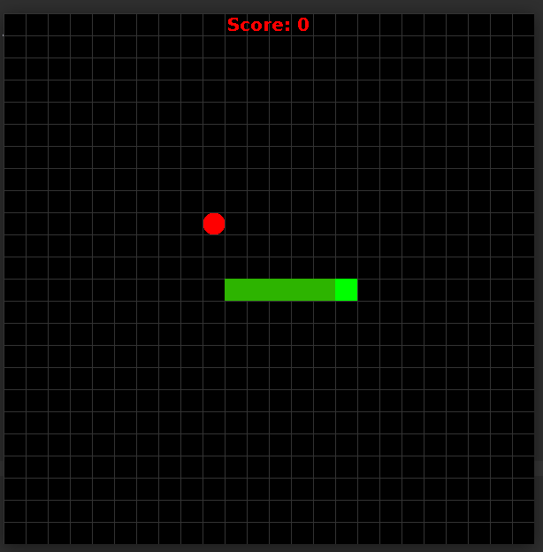
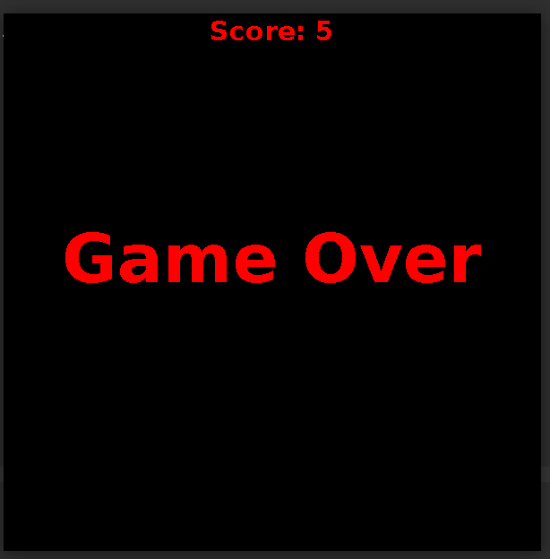

# Snake Game

## Overview

This is a simple Snake Game built using Java and Swing. The game features classic snake movement, target collection, and a Game Over screen with a displayed score.

## Features

- Grid-based movement
- Random target placement
- Score tracking
- Game Over screen
- Keyboard controls (Arrow keys to move the snake)

## What I Learned

During the development of this project, I learned:

- How to use Java Swing (`JFrame`, `JPanel`, `Graphics`) for UI rendering.
- Implementing game loops using `Timer`.
- Handling user input with `KeyListener`.
- Managing game states (running, game over).
- Drawing graphics (grid, snake, and target) with `Graphics`.

## Screenshots

## Controls

- **Arrow Keys**: Move the snake (Up, Down, Left, Right)
